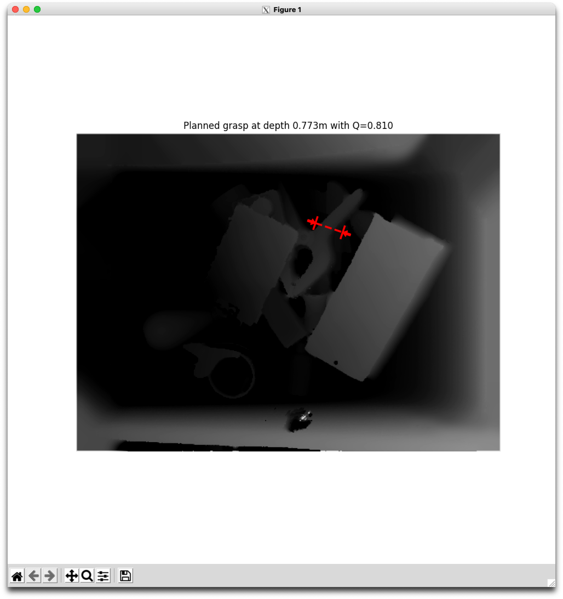

# Docker image for BerkeleyAutomation's gqcn


This is a docker image for [BerkeleyAutomation grasp planning](https://github.com/BerkeleyAutomation/gqcnn) specifically build for the Apple M1 Processor.
I haven't tested it, but it should work on any arm64 platform.

I created this, because the one provided didn't work on arm64 platform, since tensorflow1 hasn't been build for the arm64 platform.

More information about what the gqcnn package does can be found in [their repo](https://github.com/BerkeleyAutomation/gqcnn)!

## Usage
You can use this image as a starting point for grasp planning.

## Example
To enable visual output you need have [XQuartz](https://www.xquartz.org) running.

If not already done, allow access to XQuartz from localhost:

```
xhost + 127.0.0.1
```

An example docker-compose.yml could look like this:
````yaml
version: "3"

services:
  gqcnn:
    image: tdreier/gqcnn:latest
    environment:
      - DISPLAY=host.docker.internal:0
      - PROTOCOL_BUFFERS_PYTHON_IMPLEMENTATION=python
    network_mode: "host"
    volumes:
      - /tmp/.X11-unix:/tmp/.X11-unix
````

In the container, you can then execute the following (example from [GQCNN documentation](https://berkeleyautomation.github.io/gqcnn/tutorials/tutorial.html#sample-inputs)):
```shell
# go into the gqcnn directory
cd /usr/src/gqcnn

# run the example code
python examples/policy.py GQCNN-4.0-PJ --depth_image data/examples/clutter/phoxi/dex-net_4.0/depth_0.npy --segmask data/examples/clutter/phoxi/dex-net_4.0/segmask_0.png --camera_intr data/calib/phoxi/phoxi.intr
```

This should output the following:



## Special thanks
* Special thanks to [KumaTea](https://github.com/KumaTea), who's [tensorflow wheel](https://github.com/KumaTea/tensorflow-aarch64) made this possible!

